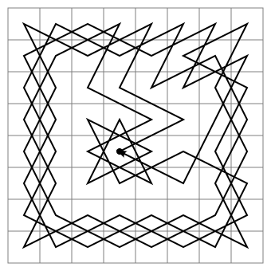
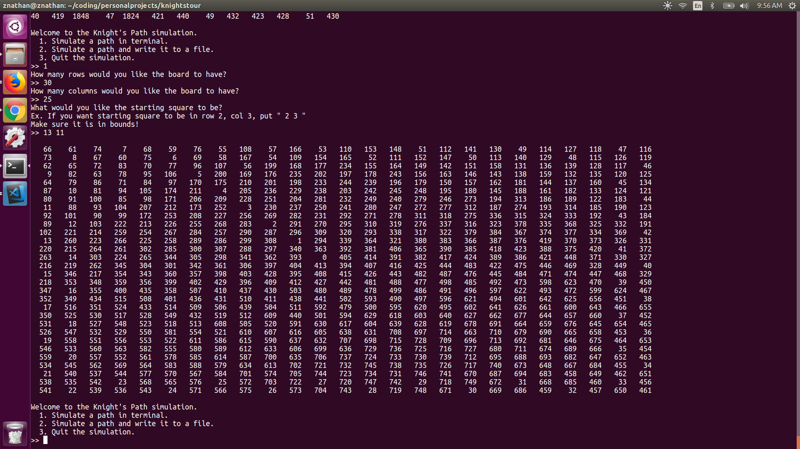
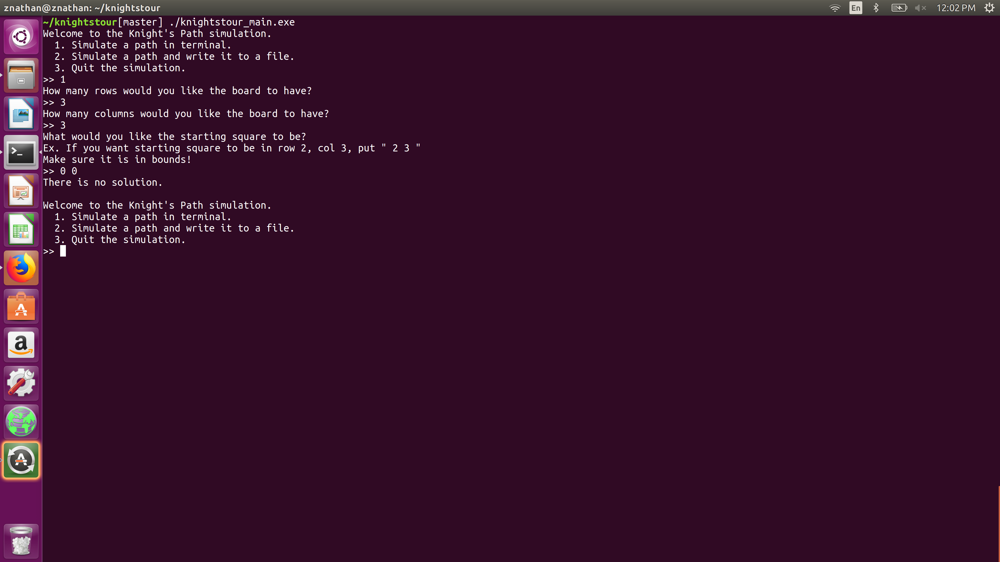
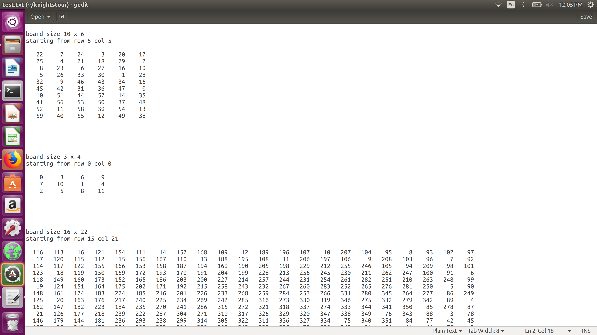

# Knight's Tour
Created by <b>Nathan Zhu</b>.

## Introduction

This is a command-line interface program designed to find open Knight's tours on various-sized chessboards.  A <a href="https://en.wikipedia.org/wiki/Knight%27s_tour ">Knight's Tour</a> is a special example of a Hamiltonian path. It is defined as the problem of finding a sequence of moves of a knight on a chessboard so that the knight can visit every square of the chessboard only once.  If the knight ends on a square that is one knight's move from the starting square, then it is a closed circuit.  Otherwise, it is defined as an open circuit.  While the math proofs below are about closed circuits, this program endeavors to just find a circuit, and most of the time it returns an open circuit.

While normal chessboards are 8 by 8, the knight's tour is generalizable to rectangular boards of all sizes; it is even applied
to non-rectangular boards.  However, this program only handles rectangular boards of 210 x 210 or smaller.


 </img>
<br>

## Setting Up & Running

### Setup
The setting up is straightforward.  Open terminal and type in both commands (without the $).  This should successfully
set up the project.  This should should create a new directory called knightstour.  To then run the program, navigate to
the directory and follow the directions below to run the program.

```
$  curl -OL https://github.com/nathanzhu144/knightstour/raw/master/knight_setup.sh
$  bash knight_setup.sh
```

### Running the Program
To run this program, just run the following command.  Again, omit the $.  This should run the program.  If you have an error
saying that the file does not exist check to make sure that you are currently in the knightstour directory.
```
$  bash knight_run.sh
```

<br>

## Time Complexity Analysis

This program is a modified brute-force algorithm.  The brute-force algorithm tries out all possible moves a knight can make until it finds a tour and backtracks if it finds that a tour cannot be made with that move.

A naive implementation of this program doing a depth-first search without any heuristics will struggle with runtime issues,
since the complexity of this program is exponential, with a runtime of O(k<sup>N</sup>), where N is the total number of
squares in the chessboard itself and k is the average branching factor of the board.  Since the size of k represents the average branching factor of the board, it has to be a constant value between 0 and 8, as at most a knight at a given position can have 8 possible moves, and the least number of possible moves a knight can have at a given position is no possible moves. It is sufficient to say that given the exponential nature of the problem, a brute force solution will not finish running in a reasonable amount of time for boards bigger than 10 by 10 boards.

The implemented solution in this program still uses a brute-force solution, but uses a heuristic to reduce runtimes. Although the complexity of the program is difficult to analyze, in practice it makes the program run in roughly linear time.  

The heuristic used is called Warnsdoff's heuristic, simply that before attempting each move, we count the number of possible moves from the new position, and choose the move that leads to a position with the fewest moves.  While this may sound counterproductive, a major issue in generating random Knight's tours is that the knight will eventually get stranded on one side of the board.  However, by choosing to go to harder to reach positions first if possible, the knight will attempt to go to the edge of the board first, and only use middle positions when necessary later on.

The function below is used to do this.

```C++
int find_degree_of_node(int row, int col, int board[MAX_NUM_ROWS][MAX_NUM_COLS])
{
    int num_degrees = 0;

    for (int i = 0; i < NUM_MOVES; ++i)
    {
        if (is_move_good(row + row_change[i], col + col_change[i], board))
        {
            ++num_degrees;
        }
    }

    return num_degrees;
}
```

In practice, this heuristic reduces runtimes from not being able to compute a 8 x 8 board to being able to compute boards up to 210 x 210, so it is a significant improvement in runtime.  

However, as this program uses stack frames for backtracking, it crashes on large enough inputs due to the stack running out of space.   

<br>

## Functionality

### Terminal Mode 
This is a terminal program, but it can not only print out knight tours in the terminal, it can also write them to the file for later use.  

This is an example of what it will look like printed to terminal.

 
<br>

In some cases, there is no solution to a knight's tour of the given board.  A word is warning is that the program will only print that there are no solutions after exhausting every possible orientation.  So, while for smaller boards, it will print that there is no solution, for larger boards, what may happen is that the program will take forever to finish running, given the exponential runtime of the program.


### File Mode


<br>

There is the functionality of printing the boards to a file.  This can be chosen with menu option #2.  In the file printing option, the user can name a file they want to save the board to.  Then, they can either append or overwrite that file in each successive board experiment.  


<br>
<br>

## Sources
http://interactivepython.org/runestone/static/pythonds/Graphs/KnightsTourAnalysis.html <br>
http://math.oregonstate.edu/~math_reu/proceedings/REU_Proceedings/Proceedings2002/2002AL_McGown.pdf <br>
https://pdfs.semanticscholar.org/c3f5/e69e771771de1be50a8a8bf2561804026d69.pdf <br>
